## About Me

I’m **Mohammed Kamal**, an Automation Engineer from Erbil, Kurdistan, Iraq. I enjoy turning ideas into practical, reliable solutions and improving how systems and applications work.

- Interested in automation, computer vision, and artificial intelligence
- Building mobile applications with Flutter, Dart, Kotlin, and Java
- Developing responsive web interfaces with modern JavaScript technologies
- Open to collaborating on practical automation and software projects

## Tech Stack

## Featured Projects

<table>
<tr>
<td width="50%" valign="top">

### Object Detection and Counting

A Dart project for real-time and image-based object detection and counting with the YOLO deep-learning model.

[View repository](https://github.com/MuhamadKamalSaleh/Object-Detection-and-Counting-)

</td>
<td width="50%" valign="top">

### Huffman Coding

A complete Java implementation of the Huffman lossless data-compression algorithm.

[View repository](https://github.com/MuhamadKamalSaleh/HufmanCoding)

</td>
</tr>
<tr>
<td width="50%" valign="top">

### Weather App

A JavaScript weather application that presents useful weather information through a focused interface.

[View repository](https://github.com/MuhamadKamalSaleh/WeatherApp)

</td>
<td width="50%" valign="top">

### Flutter BMI Calculator

A Flutter application for calculating and presenting body mass index results.

[View repository](https://github.com/MuhamadKamalSaleh/BMI-Calculator-with-flutter)

</td>
</tr>
</table>

## $ git log --stat

## $ cat contribution_graph.txt

## Connect With Me

